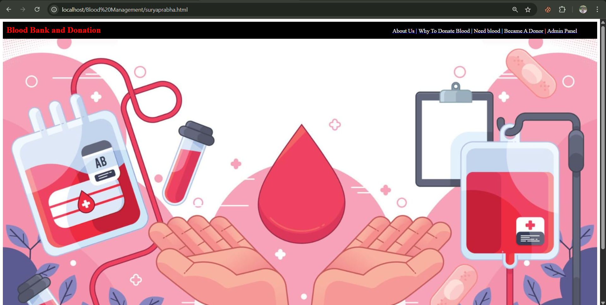
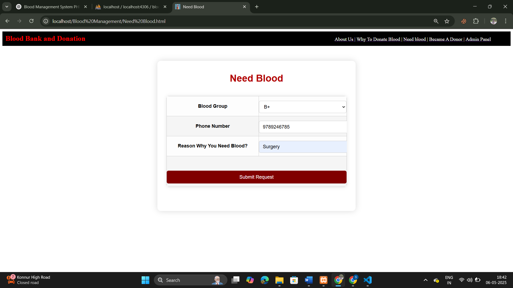
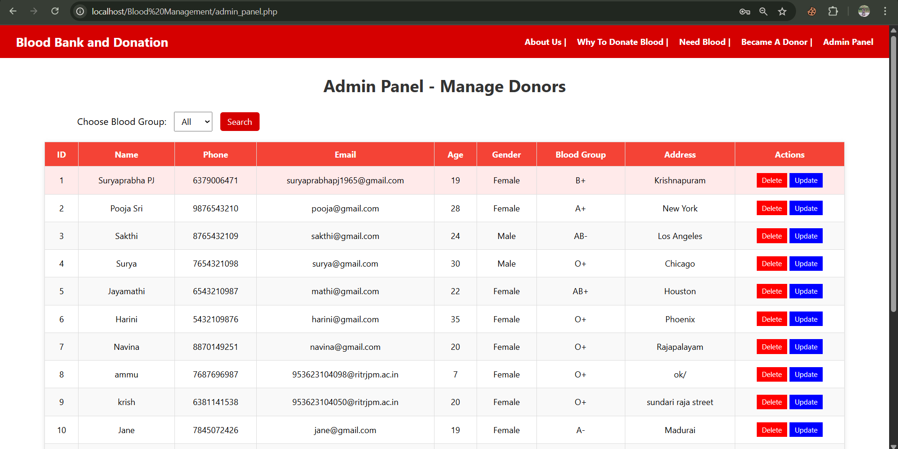

# 🩸 Blood Donation and Request Management System

## 📌 Project Overview

This project is a web-based application designed to manage and streamline the process of blood donation and request handling. It enables donors to register, patients to submit blood requests, and admins to manage both. It improves communication between donors and recipients while supporting emergency needs in a systematic way.

---

## 🎯 Objectives

- Maintain a real-time donor database.
- Enable patients or hospitals to request blood by blood group.
- Provide admins with a dashboard to view and manage donors and blood requests.
- Ensure secure and ACID-compliant data operations.

---

## 🚀 Features

### 👤 Donor View
- Donor registration with name, blood group, contact, etc.
- Stores donor data securely in the database.

### 🩸 Blood Request View
- Allows users to request blood with required group and reason.
- Stores requests and links them for admin review.

### 🛠️ Admin Panel
- Login-based access.
- View all registered donors.
- View all submitted blood requests.
- Delete or update records.

---

## 🛠️ Tech Stack

| Layer       | Technology         |
|-------------|--------------------|
| Frontend    | HTML, CSS, JavaScript |
| Backend     | PHP                |
| Database    | MySQL              |
| Server      | Apache (via XAMPP) |
| Tools       | VS Code, phpMyAdmin, Browser |

---

## 🗃️ Database Design

### Tables:
- `donors` (id, name, blood_group, phone, age, gender, email, address, last_donation_date)
- `blood_requests` (id, name, blood_group, contact, hospital, reason, requested_at)
- `admin` (admin_id, username, password)

### Views:
- `donor_view` – Displays all donor records.
- `requested_blood_view` – Displays all blood requests.
- `admin_view` – Combines donor and request info.

### Stored Procedures:
- `RegisterDonor(...)` – Registers a new donor.
- Additional procedures for future scalability.

---

## 🧪 ACID Compliance

- **Atomicity**: Each registration/request is processed completely or not at all.
- **Consistency**: Validates blood group, phone format, etc.
- **Isolation**: Concurrent requests are handled safely.
- **Durability**: Data is retained even after unexpected shutdowns.

---

## 📷 Screenshots 
- 
- 
- 
- 

---

## 📦 How to Run

1. Install [XAMPP](https://www.apachefriends.org/index.html).
2. Start Apache and MySQL.
3. Import the `bloodmanagement.sql` file into phpMyAdmin.
4. Place project files in `htdocs` directory.
5. Open browser and visit: `http://localhost/blood-donation/index.html`
   
